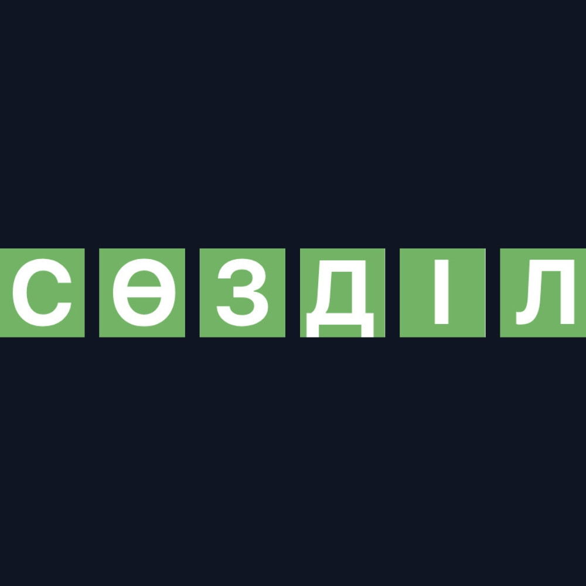
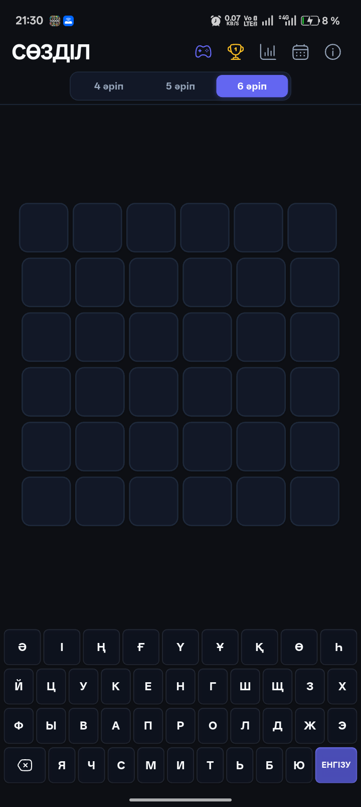
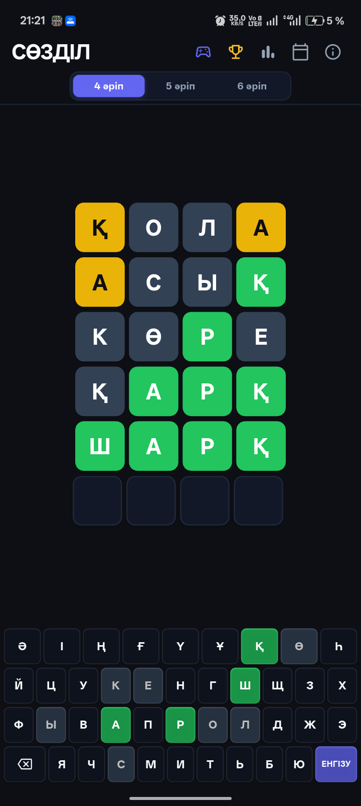
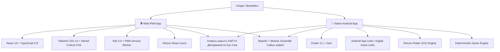

# Сөзділ — Қазақша Wordle & Native Mobile App 🎯🇰🇿

<div align="center">



### Қазақ тіліндегі заманауи сөз табу ойыны (Web + Android Mobile App)
**Күн сайын жаңа қазақша сөздерді тауып, сөздік қорды дамытуға, достармен сайысуға және үздіксіз серияларды жинауға арналған экожүйе.**

[](https://sozdil.vercel.app/)
[](https://github.com/Azamaperdeev05/sozdil/releases/tag/v2.0.0)
[](https://pagespeed.web.dev/analysis/https-sozdil-vercel-app)
[](https://flutter.dev/)
[](https://react.dev/)
[](https://www.typescriptlang.org/)
[](LICENSE)

[🌐 Веб-нұсқада ойнау](https://sozdil.vercel.app/) • [📱 Android APK жүктеу](https://github.com/Azamaperdeev05/sozdil/releases/tag/v2.0.0) • [📖 Ережелер](#-ойын-ережелері) • [🏆 Жетістіктер](#-жетістіктер-жүйесі-50-бейдж) • [🏗 Архитектура](#-технологиялық-архитектура)

</div>

---

## 📱 Көрнекі көрінісі (Screenshots)

<div align="center">
  
  &nbsp;&nbsp;&nbsp;&nbsp;
  
</div>

---

## 🌟 Басты мүмкіндіктер (Features)

### 1. 🔤 Үш түрлі сөз ұзындығы (4, 5, 6 әріп)
* **4 әріптік режим:** Шапшаң әрі қызықты ойлануға арналған бастапқы деңгей.
* **5 әріптік режим:** Классикалық әлемдік Wordle стандарты.
* **6 әріптік режим:** Сөздік қоры бай, күрделі сөздерді шешуді ұнататын эрудиттерге арналған.

### 2. ⚔️ «Досыңа сөз жасыр» Сайыс жүйесі (P2P Challenge)
* Кез келген қазақша сөзді енгізіп, досыңызға құпия сілтеме жасауға болады.
* **Қауіпсіз Base62 + Bitwise Scramble шифрлауы:** Жасырын сөз сілтеме ішінде ашық жазылмайды (мысалы: `sozdil.vercel.app/?c=1em84i0d`).
* **Android App Links қолдауы:** Досыңыз сілтемені басқан кезде телефон баптауынсыз, бірден тікелей **Сөзділ** мобильді қосымшасында ашылады!

### 3. 🏆 50+ Жетістіктер мен Бейдждер жүйесі (Gamification)
* 6 санат бойынша толыққанды марапаттар топтамасы:
  * 👑 **Жеңістер тәжірибесі:** 1, 5, 10, 25, 50, 100, 250, 500 жеңіс бейдждері.
  * 🔥 **Үздіксіз сериялар:** 2, 3, 5, 7, 14, 30, 60, 100 күн қатарынан ойнау.
  * 🎯 **Шеберлік пен мергендік:** «Көріпкел» (1-ші қадамнан табу), «Мерген» (2-ші қадамнан табу), «Қыл үстінде» (6-шы қадамда табу).
  * 📚 **Режим білгірлері:** 4, 5, 6 әріптік режимдерді толық меңгеру.
  * ⚔️ **Сайыс шеберлері:** Достарына сөз жасырып, құпия сілтемелер шешу.
  * 🇰🇿 **Тіл қазынасы:** Төл қазақ әріптері («Ә, І, Ң, Ғ, Ү, Ұ, Қ, Ө, Һ») бар сөздерді табу.

### 4. 📅 Ойын тарихы мен Интерактивті Күнтізбе
* Өткен күндердің сөздерін қайта ашып ойнау мүмкіндігі.
* Жеңіс (🟩) және жеңіліс (🟥) нәтижелерін ай сайын көру.

### 5. ⚡ Жоғары жылдамдық және Офлайн (PageSpeed 100/100 & Offline-First)
* **100% Офлайн режим:** Интернет болмаған кезде де ойын және статистика толық жұмыс істейді.
* **Нөлдік серверлік шығын:** Барлық сөздіктер мен алгоритмдер клиент жағында детерминистік түрде орындалады.
* **Ресми Reicon SVG жүйесі:** Векторлық, пиксельдік дәлдікпен (pixel-perfect) жасалған бірыңғай иконкалар.

---

## 🎮 Ойын ережелері (Rules)

Жасырын сөзді табу үшін **6 мүмкіндік** беріледі. Әр сөзді енгізгеннен кейін ұяшықтардың түсі өзгереді:

| Түс | Мағынасы | Мысал |
|:---:|---|---|
| 🟩 **Жасыл** | Әріп сөзде **бар** және **өз орнында** тұр. | `[Қ]` А Р Қ Ы С |
| 🟨 **Сары** | Әріп сөзде **бар**, бірақ **басқа орында** тұр. | Қ `[А]` Р Қ Ы С |
| ⬛ **Сұр** | Әріп жасырын сөзде **мүлдем жоқ**. | Қ А `[Р]` Қ Ы С |

---

## 🏗️ Технологиялық архитектура (Tech Stack)



### 🌐 Веб-қосымша (Web PWA):
* **React 19 & TypeScript:** Қатаң типтелген компоненттік архитектура.
* **Tailwind CSS v4:** Минималды өлшемді, өте жылдам стильдер.
* **Critical CSS Inlining:** Барлық стильдер `index.html` ішіне кірістіріліп, желі кідірісі 0-ге түсірілген.
* **Vercel Edge Network:** Әлемдік деңгейдегі лездік жариялау.

### 📱 Мобильді қосымша (Mobile Flutter):
* **Flutter & Dart:** Жылдам, 60/120 FPS бірқалыпты анимациялар.
* **Android App Links:** `sozdil.vercel.app` домені мен қолданбаның ресми сертификаты арасындағы Digital Asset Links верификациясы.
* **Reicon Flutter:** Ресми SVG иконкалар жүйесі (`reicon_flutter`).
* **Offline SharedPreferences:** Барлық ойын тарихы мен жетістіктерді құрылғыда қауіпсіз сақтау.

---

## 📁 Жобаның құрылымы (Project Structure)

```text
sozdil/
├── components/                # React веб-компоненттері
│   ├── AchievementsModal.tsx  # Жетістіктер модаль терезесі
│   ├── CalendarModal.tsx      # Күнтізбе және тарих архиві
│   ├── ChallengeModal.tsx     # Сайысқа сөз жасыру терезесі
│   ├── EndGameModal.tsx       # Ойын соңы және нәтиже бөлісу
│   ├── Grid.tsx               # 6 қатарлы сөз ұяшықтары
│   ├── Header.tsx             # 2 қатарлы эргономикалық мәзір
│   ├── InfoModal.tsx          # Ережелер мен нұсқаулық
│   ├── Keyboard.tsx           # 35 әріпті қазақша пернетақта
│   └── StatsModal.tsx         # Жеке статистика
├── lib/                       # Бизнес логика (Web)
│   ├── achievements.ts        # 50+ жетістік логикасы
│   ├── challenge.ts           # Base62 шифрлау модулі
│   ├── gameTime.ts            # Күн ауысуын есептеу
│   └── getTodayWord.ts        # Күн сөзін таңдау алгоритмі
├── mobile/                    # 📱 Flutter мобильді қосымшасы
│   ├── android/               # Android платформалық модульдері & Keystore
│   ├── assets/words/          # 25,000+ қазақша сөздіктер (JSON)
│   └── lib/
│       ├── constants/         # Түстер, пернетақта орналасуы
│       ├── models/            # Жетістік, әріп күйлерінің модельдері
│       ├── services/          # Ойын қозғалтқышы, сақтау, сайыс
│       └── widgets/           # Header, Grid, Keyboard, Modals, ReiconWidget
├── public/                    # Статикалық ресурстар
│   ├── .well-known/           # Android Digital Asset Links (assetlinks.json)
│   ├── logo.jpg               # Бағдарламаның логотипі
│   └── manifest.json          # PWA манифесті
├── words_4.ts                 # 4 әріпті сөздер қоры (Web)
├── words_5.ts                 # 5 әріпті сөздер қоры (Web)
├── words_6.ts                 # 6 әріпті сөздер қоры (Web)
├── vercel.json                # Vercel SPA және .well-known баптаулары
└── vite.config.ts             # Inlined CSS плагині бар құрастырушы
```

---

## 🚀 Жергілікті іске қосу (Local Setup)

### 1. Веб-нұсқаны (Web) іске қосу:
```bash
# Репозиторийді жүктеу
git clone https://github.com/Azamaperdeev05/sozdil.git
cd sozdil

# Тәуелділіктерді орнату
npm install

# Әзірлеу режимінде іске қосу (http://localhost:5173)
npm run dev

# Өндірістік нұсқаны жинақтау
npm run build
```

### 2. Мобильді нұсқаны (Flutter) іске қосу:
```bash
cd mobile

# Пакеттерді жүктеу
flutter pub get

# Қосылған телефонда немесе эмуляторда қосу
flutter run

# Release APK жинақтау
cd android && ./gradlew app:assembleRelease
```

---

## 🔒 Қауіпсіздік және Құпиялылық (Security & Privacy)

- 🛡️ **0 сыртқы дерекқор:** Пайдаланушының ешқандай жеке ақпараты, телефон нөмірі немесе деректері жиналмайды.
- 💾 **100% Local-first:** Ойын нәтижелері мен жетістіктер тек ойыншының құрылғысында сақталады.
- 🔐 **Күшейтілген сілтемелер:** Жасырын сөздер біржақты маска арқылы шифрланып, Base62 түрінде тасымалданады.

---

## 👨‍💻 Жоба авторы (Author)

* **Әзірлеуші:** [Азамат Пердеев](https://github.com/Azamaperdeev05)
* **Telegram:** [@code_improper](https://t.me/code_improper)
* **Жоба репозиторийі:** [github.com/Azamaperdeev05/sozdil](https://github.com/Azamaperdeev05/sozdil)

---

## 📄 Лицензия (License)

Бұл жоба [MIT Лицензиясы](LICENSE) бойынша ашық код ретінде таратылады. Қазақ тіліндегі сапалы жобаларды бірге дамытайық! 🇰🇿✨
